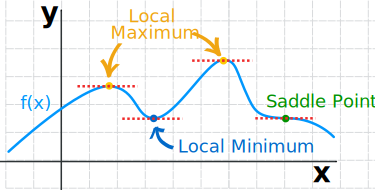

$cos^2x±sin^2x = 1$

$tan θ = {sinθ \over cosθ}$\
${d \over dθ}tanθ = sec^2θ$

${d \over dx}x = 1$

${d \over dx}ln(x) = {1 \over x}$

## Local maximum
Is a point `a` that is in the top of some region in a graph.\

## Local minimum 
Is a point `b` that is in the lowest position of some area in a graph.

If `a` is a local optimal(minimum or maximum), so $f'(a) = 0$

