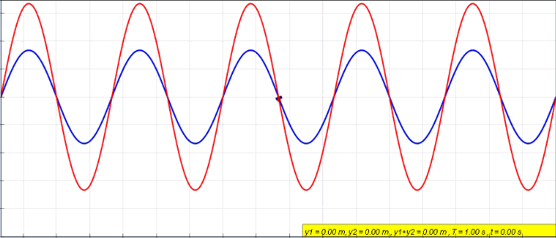

* Schrodinger treated electrons mathematically as matter waves
* this model is known as quantum mechanical or wave mechanical model
* Once an electron is quantized this is similar to a standing wave

* Given that are some points that are always zero, there are just some possible wavelengths for any standing wave, so the standing wave is quantized

* Hψ=Eψ --> Schrodinger simplified equation --> ψ is the wave function, H is the Hamiltonian operator and E is the energy of the electron
* using this equation will give us multiple wave functions, each with an allowed value for E

* The Heisenberg uncertainty principle --> we can only know, with precision, the position or the energy of an electron, not both at the same time
* to approximate the location of the electron 
  * the wave function from an atom is called atomic orbitals
  * the atomic orbital is defined as the region in the atom, that the electron is there approximately 90% of the time

* The Heisenberg uncertainty principle can be described as:
  * Δx⋅Δp ≥ h/4π --> Δx is the uncertainty in the electron's position and Δp is the uncertainty in the electron's momentum (energy)
  * Δx and Δp are inversely proportional

* the wave function value is proportional to the amplitude of the electron matter wave
* the square of the wave function is proportional to the probability to find an electron in a particular region of the atom. The wave function squared is also called probability density

* Nodes are regions that has 0 probability to find an electron

* spin-up --> ms = 1/2  
* spin-down --> ms = -1/2

* an electron can have only magnetic field up (spin-up) or down (spin-down), nothing in between
  * because of that, an orbital can have only two electrons at the same time, with opposite spins <-- this is called Pauli exclusion principle

The Heisenberg uncertainty principle\
Δx    *  Δp\
(2)   *  (2)  = 4\
(1)   *  (4)  = 4\
(0.5) *  (8)  = 4\
\
We can see that if one certainty increase the other decreases\

Δp = m * v * percentage_of_certainty_in_decimal

* in quantum mechanics, we don't work with the position of the electron is (as in the Bohr model), but instead we work with probabilities that say if the electron is some position of the space

* orbital --> is the region of the space where the electron has a higher probability to be there

* principal quantum number (n, that is an positive integer) --> indicates the main energy level (shell) occupied by the electron
* think in an atom as a sphere and the electron can be somewhere in the space of the sphere

* angular momentum quantum number (l, shape of the orbital, l is dependent of n, so l goes from 0 to n-1)

l = 0 --> s orbital (represented by a sphere)\
l = 1 --> p orbital (represented like and 8)\
...

* n --> is known as shell
* l --> the possibilities are known as subshells

* magnetic quantum number (ml, it depends on l, it goes from -l to +l) --> represents the orientation of an orbital around the nucleus. The different possibilities that ml can have, show us all the possibilities that an orbital can be rotated in the x, y and z axis
  * note: since in the p orbital we have 3 possible orientations, in the second energy level we have in the total 6 electrons

* spin quantum number (ms, this can be +1/2(up) or -1/2(down))

* the quantity of orbitals is n^2
* the total electrons in a shell is 2 * n^2

* every energy level (n) has your own orbitals and your own electrons
